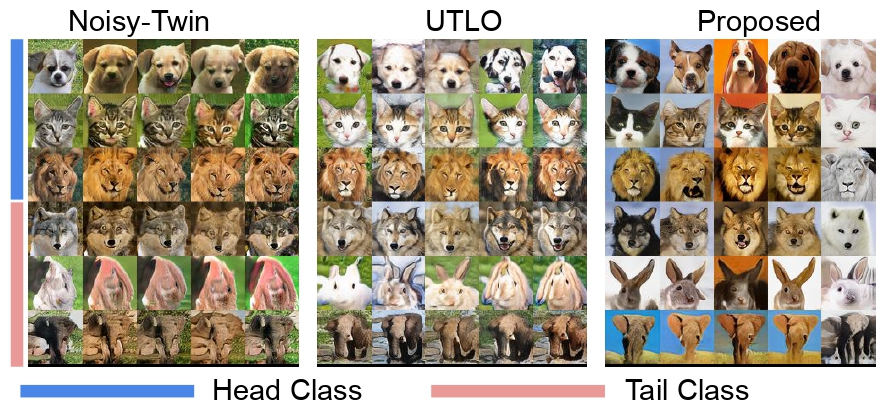

# Long-Tail Class Generation via Content-Style based Transfer Learning


<p align="center">
  <a href="https://subashtimilsina.github.io/projects/longtail.html"><b>Read More on Project (Project Page)</b></a>
  &nbsp;·&nbsp;
</p>



## Abstract

Real-world image datasets are almost never balanced. A handful of head classes carry the bulk of the samples, while a long list of tail classes have only a few. When a class-conditional generative model — e.g. a conditional GAN (cGAN) — is trained on such data, two failure modes appear:

- **Mode collapse on tail classes.** The generator produces near-identical outputs for any tail-class condition; diversity vanishes.
- **Drop in fidelity.** Tail samples look distorted or unrealistic, even when head-class samples look great.

The natural way out is knowledge transfer from head to tail: similar classes (e.g. dog breeds) share most of their generative process, so the few samples we have for a tail class should benefit from the abundant samples of nearby head classes. Most prior work — GSR-GAN, Transitional GAN, Noisy-Twin, UTLO — implements this idea with heuristics on architecture, regularization, or training schedules. We instead ground head-to-tail transfer in a principled content–style generative model that explicitly separates what is shared across classes (content) from what is class-specific (style).

## Overview

This repository extends [StyleGAN2-ADA (PyTorch)](https://github.com/NVlabs/stylegan2-ada-pytorch) and borrows long-tail dataset utilities from [UTLO](https://github.com/khorrams/utlo). The main methodological change is a **content–style generator mapping**: latent noise is split into content and style branches, with class labels modulating the style path. Training and evaluation otherwise follow the StyleGAN2-ADA workflow (`train.py`, `calc_metrics.py`, ADA augmentation, and shot-based FID/KID metrics).

**Typical workflow**

1. Install the conda environment.
2. Download raw data and pack it into a dataset folder or ZIP with `dataset.json` labels.
3. Build a long-tailed label file with `lt_dataset.py` (e.g. `lt_25.json`).
4. Train with `train.py` (see `lt_scripts/` for per-dataset examples).
5. Sample images with `generate_c_s.py` (content–style sampling).

## Requirements

- **OS:** Linux recommended (Windows is supported by StyleGAN2-ADA but NVCC/Visual Studio setup is more involved).
- **Hardware:** Tested with NVIDIA GPUs; set `CUDA_VISIBLE_DEVICES` in the launch scripts. Multi-GPU training is supported via `--gpus`.
- **Software:** Conda environment from `environment.yml` (Python 3.8, PyTorch 2.2, CUDA 12.1). Custom CUDA ops are compiled on first run via NVCC.
- **Logging (optional):** [Weights & Biases](https://wandb.ai/). Run `wandb login` once; training logs to project `long_tail` (see `training/training_loop.py`). Disable with `wandb.init(mode="disabled")` if you edit that block.
- **Metrics:** Set `INCEPTION_PATH` to a directory containing TensorFlow Inception weights used for FID/KID (same convention as StyleGAN2-ADA / UTLO).

```bash
conda env create -f environment.yml
conda activate i2i   # environment name in environment.yml
```

On Windows, install [Visual Studio](https://visualstudio.microsoft.com/vs/) and expose `vcvars64.bat` on `PATH` so NVCC can compile the custom ops.

## Getting started

### 1. Download raw datasets

`download_dataset.sh` fetches several public datasets used in the paper (Animal Faces, CIFAR-10/100, Oxford Flowers-102, LSUN bedroom). Adjust the script if you only need a subset.

```bash
bash download_dataset.sh
```

For **Animal Faces**, the archive is extracted under `./Image/`. Use `dataset_tool.py` and/or `make_json_label.py` to produce a labeled folder or ZIP with `dataset.json` (see [StyleGAN2-ADA dataset prep](https://github.com/NVlabs/stylegan2-ada-pytorch/blob/main/README.md#preparing-datasets) and `python dataset_tool.py --help` / [docs/dataset-tool-help.txt](docs/dataset-tool-help.txt)).

### 2. Pack and imbalance the data

Edit the paths in [`prepare_dataset.sh`](prepare_dataset.sh), then run:

```bash
bash prepare_dataset.sh
```

That script prepares each benchmark in **two steps**:

**Step 1 — Pack images** (`dataset_tool.py`)

Converts raw downloads into a StyleGAN2-ADA dataset folder (PNG layout + `dataset.json`).

```bash
python dataset_tool.py --source=<raw_images> --dest=<output_dataset> \
  --transform=center-crop --width=128 --height=128
```

Use `--width=32 --height=32` for CIFAR. See `python dataset_tool.py --help` and [docs/dataset-tool-help.txt](docs/dataset-tool-help.txt).

**Step 2 — Create a long-tailed split** (`lt_dataset.py`)

Writes `lt_<imf>.json` beside `dataset.json`. `--imf` is the head-to-tail imbalance ratio; `--shot-labels` adds per-shot JSON files for `fid_shots` / `kid_shots`.

```bash
python lt_dataset.py --fn <output_dataset>/dataset.json --imf 25 \
  --shot-labels --dname animals
```

Supported `--dname` values: `animals`, `flowers`, `cifar10`, `cifar100`, `lsun`, `afhq`.

`prepare_dataset.sh` runs these commands for Animal Faces, Flowers-102, LSUN, CIFAR-10, and CIFAR-100 (with dataset-specific paths, resolutions, and `--imf` values). Run the steps individually if you only need one dataset.

Point training at the dataset directory and the long-tail label file:

```bash
python train.py --data=<dataset_dir> --fname=lt_25.json --cond=1 --num_classes=20 ...
```

### 3. Training

Example launchers live in `lt_scripts/` (`af.sh`, `flowers.sh`, `cifar10.sh`, `cifar100.sh`). They set `HPC_SHARE`, `INCEPTION_PATH`, and call `train.py` with dataset-specific `--num_classes` and `--cfg`.

```bash
# Edit paths inside the script, then:
bash lt_scripts/af.sh
```

Useful flags (see `python train.py --help` and [docs/train-help.txt](docs/train-help.txt)):

| Flag | Role |
|------|------|
| `--data` | Dataset folder or ZIP |
| `--fname` | Label JSON inside the dataset (e.g. `lt_25.json`) |
| `--cond` / `--num_classes` | Class-conditional training |
| `--metrics` | Default in scripts: `fid_shots,kid_shots,fid50k_full,kid50k_full` |
| `--cfg` | `auto` for Animal Faces / Flowers; `cifar` for CIFAR |

### 4. Evaluation

Metrics run automatically during training when `--metrics` is set. Logs appear as `metric-*.jsonl` under the run directory and in W&B if enabled. To recompute later:

```bash
python calc_metrics.py --metrics=fid50k_full \
  --network=<run_dir>/network-snapshot-*.pkl
```

Use `--metrics=none` during training for a small speedup (~3–9%). See [StyleGAN2-ADA quality metrics](https://github.com/NVlabs/stylegan2-ada-pytorch/blob/main/README.md#quality-metrics).

### 5. Generation

Use **`generate_c_s.py`** (not `generate.py`) to sample with the content–style model:

```bash
python generate_c_s.py --outdir=./results/ --seeds=0,1,2 \
  --all_class=<num_classes> --network=<path/to/network-snapshot.pkl>
```

`generate.sh` is a template with paths to edit.

Other utilities from the StyleGAN2-ADA tree (`generate.py`, `projector.py`, `style_mixing.py`, `latent_space.py`, etc.) are included for reference; the paper pipeline uses `generate_c_s.py`.

## Repository layout

| Path | Purpose |
|------|---------|
| `training/networks.py`, `training/loss.py` | Content–style mapping and style-consistency loss |
| `training/dataset.py` | Long-tail labels, class reweighting, shot metrics |
| `lt_dataset.py` | Build `lt_<imf>.json` and shot label files |
| `lt_scripts/*.sh` | Per-dataset training entry points |
| `metrics/` | FID, KID, and shot-stratified variants |
| `dataset_tool.py` | Pack raw images into StyleGAN2-ADA format |

## License

This repo builds on [StyleGAN2-ADA](https://github.com/NVlabs/stylegan2-ada-pytorch) and [UTLO](https://github.com/khorrams/utlo). See [LICENSE.txt](LICENSE.txt) and upstream licenses before redistribution or commercial use.

## Citation

```
@misc{Timilsina_etal_LongTailClassGeneration_2026,
  author       = {Timilsina, Subash and Shrestha, Sagar and Fu, Xiao},
  title        = {Long-Tail Class Generation via Content-Style based Transfer Learning},
  year         = {2026},
  howpublished = {Online project page},
  url          = {https://subashtimilsina.github.io/projects/longtail.html},
  note         = {Accessed: 2025-05-18}
}
```
